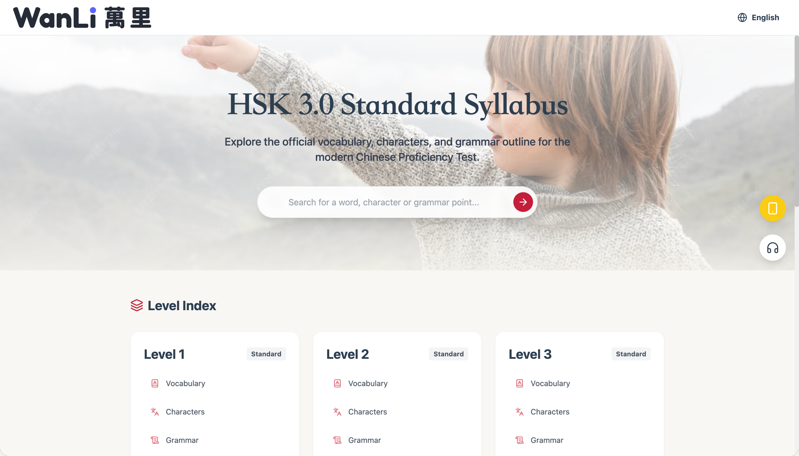
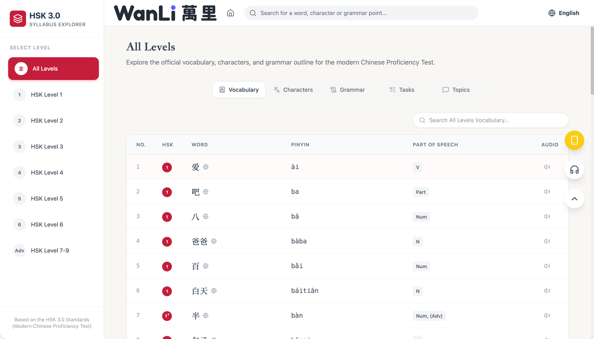
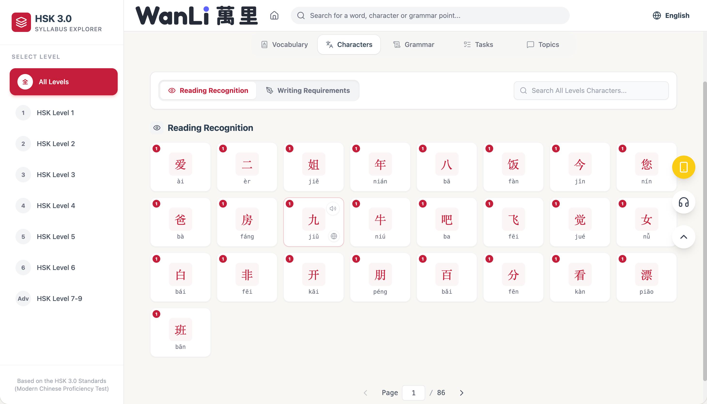
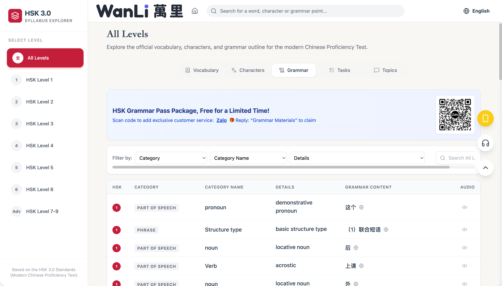
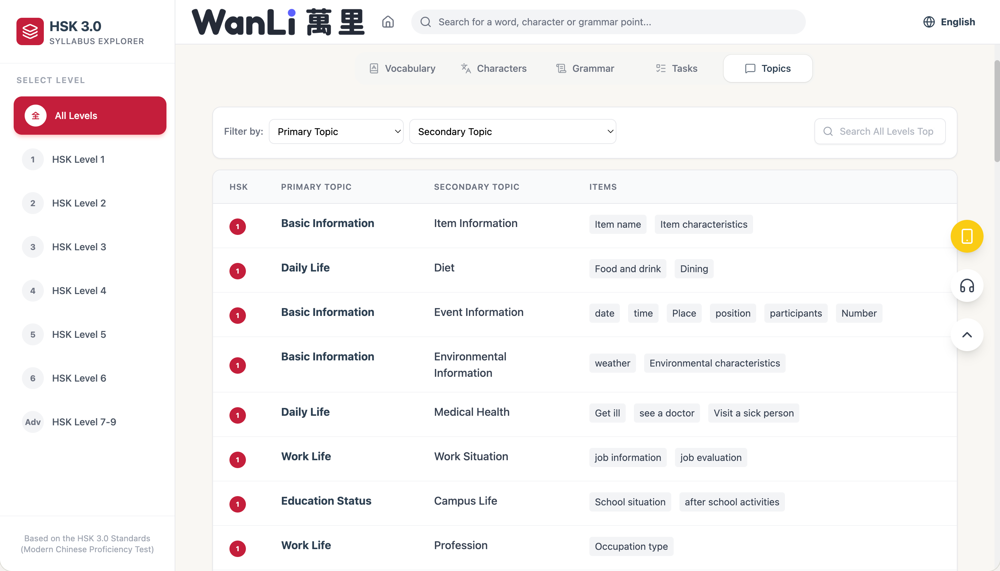
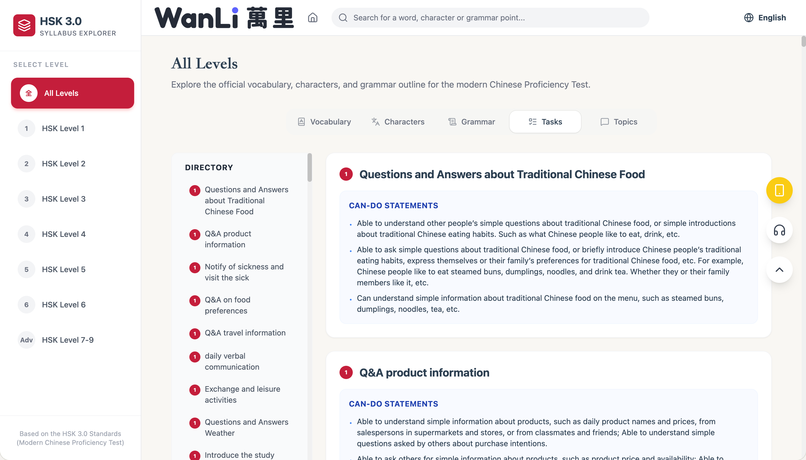

# HSK 3.0 Syllabus Explorer (WanLi 萬里)


> **Live Preview:** [https://syllabus.wanlihsk.com/](https://syllabus.wanlihsk.com/)

An interactive, responsive platform designed to help learners and educators explore the official vocabulary, characters, and grammar outlines for the modern Chinese Proficiency Test (HSK 3.0 Standard Syllabus). 

## 🌟 Key Features

* **Comprehensive Data:** Full coverage of HSK Levels 1–9, including vocabulary, characters, grammar points, topics, and tasks.
* **Smart Search:** Instantly look up any word, character, or grammar structure.
* **Multilingual UI:** Support for English, Vietnamese (Tiếng Việt), and Simplified Chinese (简体中文).
* **Modern Interface:** A clean, engaging user experience built with React and Tailwind CSS.
* **Analytics Tracking:** Built-in visitor and feature exposure tracking.

## 📸 Screenshots

1. **Home Page**
   
2. **Vocabulary Explorer**
   
3. **Character Outline**
   
4. **Grammar Points**
   
5. **Topics & Tasks**
   
   

## 🚀 Run Locally

**Prerequisites:**  
- [Node.js](https://nodejs.org/) (Version 18 or above recommended)

1. **Clone and install dependencies:**
   ```bash
   npm install
   ```

2. **Database setup (Optional for Local UI Testing):**
   Copy `.env.example` to `.env` or `.env.local` and set your `VITE_SUPABASE_URL` and `VITE_SUPABASE_ANON_KEY`.

3. **Start the development server:**
   ```bash
   npm run dev
   ```

4. **Build for production:**
   ```bash
   npm run build
   ```

## 🛠️ Tech Stack
- Frontend: React 19, TypeScript, Tailwind CSS, Vite
- Backend/Database: Supabase (PostgreSQL)
- Icons: Lucide React
